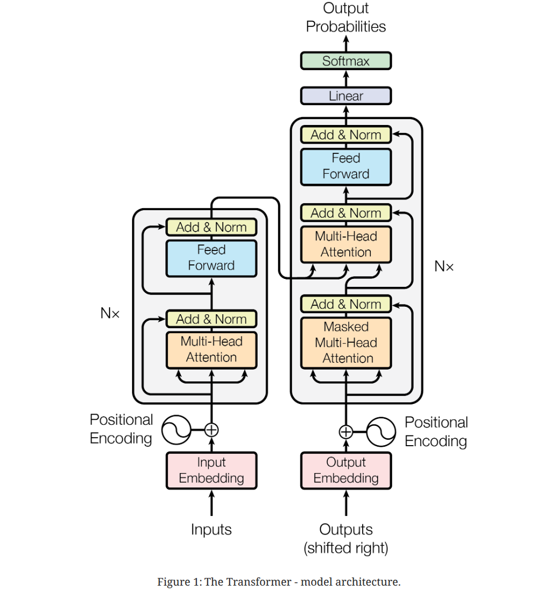
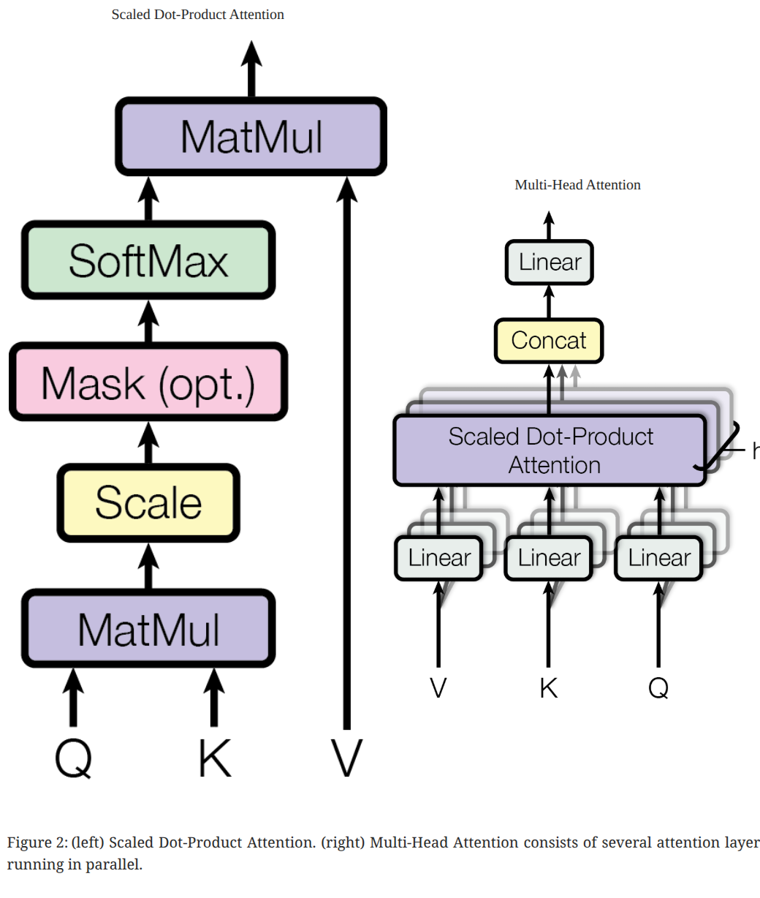
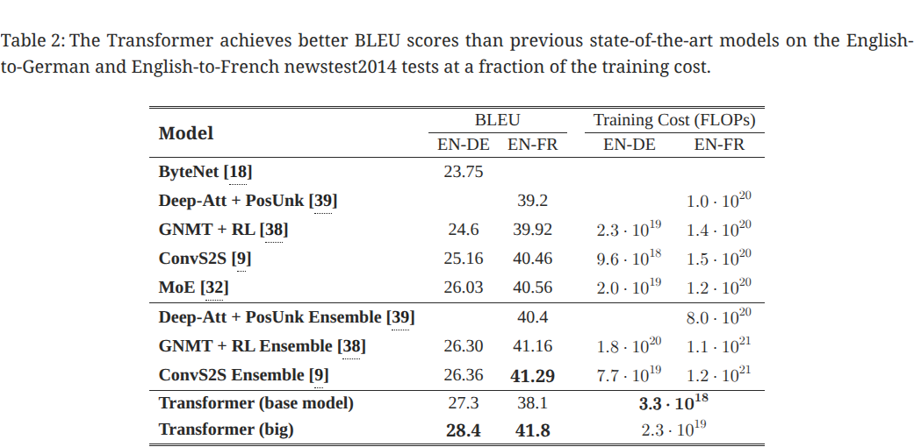
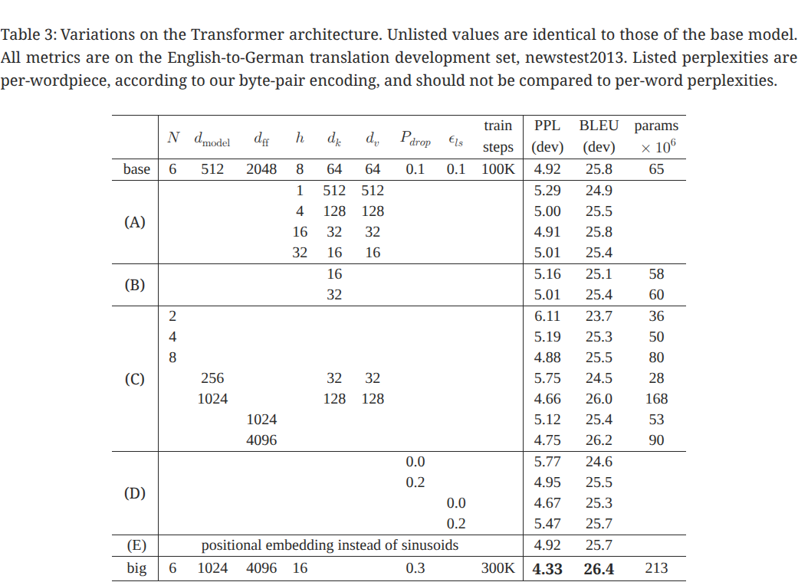
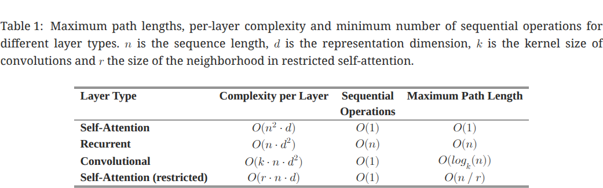
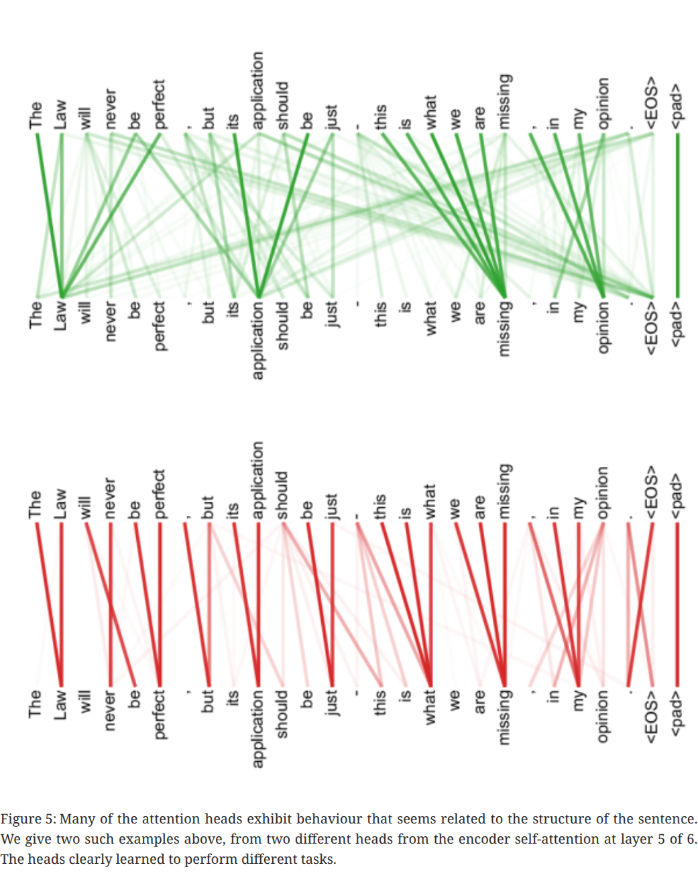

# Attention Is All You Need

## Basic Information
- **Title:** Attention Is All You Need
- **Authors:** Ashish Vaswani, Noam Shazeer, Niki Parmar, Jakob Uszkoreit, Llion Jones, Aidan N. Gomez, Łukasz Kaiser, Illia Polosukhin
- **Affiliations:** Google Brain, Google Research, University of Toronto
- **Publication Date:** 2017 (NIPS 2017)
- **Link:** https://arxiv.org/abs/1706.03762
- **Paper Type:** Empirical
- **One-Sentence Summary:** Proposes the Transformer architecture, built entirely on attention mechanisms (discarding RNNs and CNNs), achieving SOTA on machine translation tasks at extremely low training cost (EN-DE 28.4 BLEU, EN-FR 41.8 BLEU), and establishing the foundational architecture paradigm of modern deep learning.

## Research Problem
- **What problem does it solve?** The dominant sequence transduction models at the time (RNN/LSTM/GRU) suffered from an **inherent sequential computation bottleneck**: hidden state $h_t$ depends on $h_{t-1}$, preventing parallelized training and limiting efficiency on long sequences due to memory and computational constraints. CNNs can parallelize but require stacking multiple layers to capture long-range dependencies (path length $O(\log_k(n))$).
- **Key Hypothesis:** Attention mechanisms alone are sufficient to model all dependencies in a sequence, without the need for recurrent or convolutional structures.
- **Why is it important?** Sequence modeling is central to NLP, and training efficiency and long-range dependency modeling are the two major bottlenecks constraining model scale and performance.
- **Positioning relative to related work:**
  - **ConvS2S (Gehring et al., 2017):** Replaces RNNs with CNNs for parallelization, but long-range dependencies require $O(n/k)$ convolutional layers
  - **ByteNet (Kalchbrenner et al., 2016):** Dilated convolutions reduce path length to $O(\log_k(n))$, but still not constant
  - **Key distinction of this paper:** Completely discards recurrence and convolution; the path length between any two positions is $O(1)$

## Key Insight

> In sequence modeling, neither the sequential dependency of RNNs nor the local receptive field of CNNs is necessary. Through **self-attention mechanisms**, the model can directly establish dependencies between any two positions in a sequence in a single operation ($O(1)$ path length), while enabling fully parallelized training. **Multi-head attention** further allows the model to simultaneously attend to information at different positions across different representation subspaces, compensating for the information loss caused by the weighted averaging in single-head attention.

## Technical Approach

### Overall Framework and Principles

The Transformer adopts the classic **Encoder-Decoder** structure, but entirely replaces recurrent layers with self-attention and position-wise fully connected layers:

- **Encoder:** A stack of $N=6$ identical layers, each containing (1) a multi-head self-attention sub-layer + (2) a position-wise feed-forward network sub-layer
- **Decoder:** A stack of $N=6$ identical layers, each containing (1) masked multi-head self-attention + (2) encoder-decoder cross-attention + (3) a position-wise feed-forward network
- Each sub-layer uses **residual connections + layer normalization**: $\text{LayerNorm}(x + \text{Sublayer}(x))$
- All sub-layers and embedding layers have a unified output dimension of $d_{\text{model}} = 512$

**Why this design?** The unified dimensionality allows residual connections to perform direct addition without extra projections; stacking multiple layers enables the model to progressively refine representations, similar to hierarchical feature extraction in deep CNNs.

### Detailed Core Components

#### 1. Scaled Dot-Product Attention

Core formula:

$$\text{Attention}(Q, K, V) = \text{softmax}\left(\frac{QK^T}{\sqrt{d_k}}\right) V$$

- **Input:** Query ($Q$) and Key ($K$) with dimension $d_k$, Value ($V$) with dimension $d_v$
- **Scaling factor $\frac{1}{\sqrt{d_k}}$:** When $d_k$ is large, the variance of the dot product of $Q$ and $K$ is $d_k$, which pushes the softmax into saturation regions with extremely small gradients. Dividing by $\sqrt{d_k}$ stabilizes the gradients. This is a key improvement over standard dot-product attention.
- **Why dot-product instead of additive attention?** Both have similar theoretical complexity, but dot-product can leverage highly optimized matrix multiplication implementations, making it **faster in practice and more memory-efficient**.

#### 2. Multi-Head Attention

$$\text{MultiHead}(Q, K, V) = \text{Concat}(\text{head}_1, \dots, \text{head}_h) W^O$$
$$\text{head}_i = \text{Attention}(QW_i^Q, KW_i^K, VW_i^V)$$

- **Parameter matrices:** $W_i^Q \in \mathbb{R}^{d_{\text{model}} \times d_k}$, $W_i^K \in \mathbb{R}^{d_{\text{model}} \times d_k}$, $W_i^V \in \mathbb{R}^{d_{\text{model}} \times d_v}$, $W^O \in \mathbb{R}^{hd_v \times d_{\text{model}}}$
- **Configuration:** $h=8$ heads, $d_k = d_v = d_{\text{model}} / h = 64$
- **Why multi-head?** The weighted averaging in single-head attention suppresses the model's ability to simultaneously attend to different subspaces. Multi-head attention projects Q/K/V into multiple lower-dimensional subspaces and computes attention in parallel; the total computation is comparable to single-head full-dimensional attention, but with stronger representational capacity.

#### 3. Three Applications of Attention

| Application | Q Source | K/V Source | Purpose |
|-------------|----------|------------|---------|
| Encoder self-attention | Previous encoder layer output | Same as Q | Encode intra-sequence dependencies of the input |
| Decoder masked self-attention | Previous decoder layer output | Same as Q (future positions masked) | Preserve autoregressive property |
| Encoder-decoder cross-attention | Previous decoder layer output | Final encoder output | Attend to input sequence during decoding |

#### 4. Position-wise Feed-Forward Network

$$\text{FFN}(x) = \max(0, xW_1 + b_1)W_2 + b_2$$

- Two linear transformations + ReLU activation, applied independently to each position
- Inner dimension $d_{ff} = 2048$, input/output dimension $d_{\text{model}} = 512$
- Equivalent to two $1 \times 1$ convolutions

#### 5. Positional Encoding (Sinusoidal Positional Encoding)

Since there is no recurrence or convolution, the model has no way to perceive sequence order. Positional information is injected via sine/cosine functions:

$$PE_{(pos, 2i)} = \sin(pos / 10000^{2i/d_{\text{model}}})$$
$$PE_{(pos, 2i+1)} = \cos(pos / 10000^{2i/d_{\text{model}}})$$

- Wavelengths form a geometric progression from $2\pi$ to $10000 \cdot 2\pi$
- **Why sinusoidal rather than learned positional embeddings?** For a fixed offset $k$, $PE_{pos+k}$ can be expressed as a linear function of $PE_{pos}$, enabling the model to learn to attend to relative positions through linear transformations. Experiments show the two approaches perform nearly identically (Table 3, row E), but the sinusoidal version can **extrapolate to longer sequences not seen during training**.

#### 6. Additional Training Techniques

- **Embedding weight sharing:** The encoder embedding, decoder embedding, and pre-softmax linear layer share the same weight matrix; the embedding layer is multiplied by $\sqrt{d_{\text{model}}}$
- **Warmup learning rate schedule:** $lr = d_{\text{model}}^{-0.5} \cdot \min(step^{-0.5}, step \cdot warmup^{-1.5})$, linearly increasing for the first 4000 steps, then decaying proportionally to the inverse square root of the step number
- **Regularization:** Residual Dropout ($P_{drop} = 0.1$) + Label Smoothing ($\epsilon_{ls} = 0.1$)

## Experimental Results

### Results

**Experimental Setup:**
- Datasets: WMT 2014 EN-DE (4.5 million sentence pairs, BPE encoding, ~37,000 token vocabulary) and WMT 2014 EN-FR (36 million sentence pairs, word-piece, 32,000 token vocabulary)
- Hardware: 8 x NVIDIA P100 GPUs
- Inference: Beam search (beam size=4, length penalty $\alpha=0.6$), checkpoint averaging (last 5 for base, last 20 for big)

**Key Results:**

| Model | EN-DE BLEU | EN-FR BLEU | Training FLOPs |
|-------|-----------|-----------|----------------|
| GNMT + RL Ensemble | 26.30 | 41.16 | $1.8 \times 10^{20}$ / $1.1 \times 10^{21}$ |
| ConvS2S Ensemble | 26.36 | 41.29 | $7.7 \times 10^{19}$ / $1.2 \times 10^{21}$ |
| **Transformer (base)** | **27.3** | 38.1 | $3.3 \times 10^{18}$ |
| **Transformer (big)** | **28.4** | **41.8** | $2.3 \times 10^{19}$ |

- EN-DE: Transformer (big) exceeds the previous best ensemble model by **>2 BLEU**, reaching 28.4
- EN-FR: Single-model SOTA of 41.8 BLEU, with training cost less than **1/4** of the previous SOTA
- **The base model requires only 12 hours of training** (100K steps) to surpass all previously published single models and ensembles

**Ablation Studies:**

| Variable | Key Finding |
|----------|-------------|
| Number of attention heads (A) | 1 head: 24.9 BLEU -> 8 heads: 25.8 BLEU; too many heads (32 heads, $d_k=16$) begins to degrade: 25.4 |
| $d_k$ size (B) | $d_k$ from 16 to 32 has little impact, but larger models perform better |
| Model size (C) | Larger $d_{\text{model}}$ and $d_{ff}$ consistently improve performance |
| Dropout (D) | Dropout is critical for preventing overfitting; removing dropout decreases BLEU by ~1 |
| Positional encoding (E) | Learned positional embeddings and sinusoidal encoding perform nearly identically |

**English Constituency Parsing (Generalization Validation):**
- On the WSJ dataset, the Transformer achieves **91.3 F1** with **only 4 layers and $d_{\text{model}}=1024$**
- In a semi-supervised setting (augmented with BerkeleyParser corpus), it achieves **92.7 F1**, comparable to SOTA
- Demonstrates that Transformer is not limited to translation and can generalize to structured prediction tasks

### Analysis

- **Root cause of training efficiency advantage:** Self-attention reduces the path length between any pair of positions from $O(n)$ in RNNs to $O(1)$, and is fully parallelizable without waiting for the previous time step to complete. This directly translates to orders-of-magnitude training speed improvements.

| Layer Type | Complexity per Layer | Sequential Operations | Maximum Path Length |
|------------|---------------------|----------------------|---------------------|
| Self-Attention | $O(n^2 \cdot d)$ | $O(1)$ | $O(1)$ |
| Recurrent | $O(n \cdot d^2)$ | $O(n)$ | $O(n)$ |
| Convolutional | $O(k \cdot n \cdot d^2)$ | $O(1)$ | $O(\log_k(n))$ |

- When $n < d$ (a common scenario in NLP, where sentence lengths are typically much shorter than the 512-dimensional representation), self-attention is faster than RNNs
- **Multi-head attention is critical for performance:** Ablation studies show single-head attention degrades significantly (-0.9 BLEU); 8 heads is the optimal balance point
- **Attention visualization reveals understanding of linguistic structure:**

Different attention heads spontaneously learn different linguistic functions: long-range dependency tracking, coreference resolution, syntactic structure parsing, etc.

## Critical Analysis

### Strengths
- **Architectural simplicity:** A unified architecture based entirely on attention, removing the sequential bottleneck of RNNs and the local receptive field limitation of CNNs
- **Dramatic training efficiency gains:** The big model achieves SOTA in 3.5 days, with training cost 1-2 orders of magnitude lower than ensemble baselines
- **$O(1)$ path length:** Direct interaction between any positions, theoretically making it easier to learn long-range dependencies
- **Highly parallelizable:** Eliminates the sequential dependency of RNNs, fully exploiting GPU parallel computing capabilities
- **Interpretability:** Attention weight visualization provides a window into model behavior

### Limitations
- **Limitations acknowledged by the authors:**
  - Self-attention complexity $O(n^2 \cdot d)$ may become a bottleneck on extremely long sequences; the authors mention plans to investigate restricted attention (limiting the receptive field to $r$, changing path length to $O(n/r)$)
- **My observations:**
  - **$O(n^2)$ memory issue:** The attention matrix requires $O(n^2)$ storage, limiting the model's ability to handle very long sequences such as long documents and images (subsequently spawning extensive work on Sparse Attention, Linear Attention, Flash Attention, etc.)
  - **Limitations of positional encoding:** Although sinusoidal positional encoding can theoretically extrapolate, its practical extrapolation capability to very long sequences is limited (later approaches such as RoPE and ALiBi emerged to address this)
  - **Validated only on translation and constituency parsing:** At the time of publication, the model was not systematically validated on a broader range of NLP tasks (such as classification, generation, QA), although subsequent BERT/GPT series proved its generality
  - **Training stability:** The warmup learning rate schedule is necessary (training directly with a large learning rate is unstable); the paper does not deeply discuss why Transformers require this particular warmup strategy
  - **The cost of Label Smoothing:** It hurts perplexity but improves BLEU, hinting at contradictions between evaluation metrics; the paper does not explore this in depth

### Reproducibility Assessment
- **Open-source code:** Yes ([tensor2tensor](https://github.com/tensorflow/tensor2tensor))
- **Data availability:** Yes (WMT 2014 public datasets)
- **Key implementation details:** Thoroughly described, including all hyperparameters, training steps, hardware configuration, and FLOPs estimation methodology

## Summary and Evaluation

### Three-Perspective Conclusions (Following Andrew Ng's Framework)

**Authors' Conclusion:** They propose the first fully attention-based sequence transduction model, the Transformer, which achieves new SOTA on translation tasks at significantly lower training cost and successfully generalizes to constituency parsing. The authors anticipate that future applications of attention-based models will extend beyond text to images, audio, and video.

**Personal Assessment:**
- The authors' core claim -- that attention mechanisms are sufficient to replace recurrence and convolution -- is thoroughly validated by experiments; the +2 BLEU improvement on EN-DE was a very significant advance at the time
- The training efficiency improvement (12 hours for base / 3.5 days for big vs. weeks for RNN models) is an underappreciated contribution, as it made subsequent large-scale pretraining (BERT, GPT) feasible
- The authors' predictions about future directions were remarkably accurate: Transformers have indeed been successfully extended to vision (ViT), audio (Whisper), multimodal (GPT-4), and virtually every other domain

**Overall Assessment:**
- **Core Idea:** Completely replace recurrence and convolution with self-attention mechanisms, achieving $O(1)$ path length and fully parallelized sequence modeling
- **Main Highlights:** Simple yet general architecture, orders-of-magnitude training efficiency improvement, established the architectural foundation for the "pretrain + fine-tune" paradigm
- **Future Directions:** The paper directly gave rise to BERT (Encoder-only), the GPT series (Decoder-only), ViT (vision), and extensive subsequent research on long-sequence efficiency (Sparse/Linear/Flash Attention)
- **Rating:** **Groundbreaking** -- This is one of the most influential papers in deep learning over the past decade, fundamentally changing the direction of NLP and broader AI research

### Comprehension Verification (Post-Writing Self-Check)
1. **What were the authors trying to accomplish?** To demonstrate that a purely attention-based architecture can replace RNN/CNN for sequence transduction, while achieving better performance and higher training efficiency
2. **What are the key elements of the approach?** Scaled Dot-Product Attention + Multi-Head Attention + Residual Connections + Layer Normalization + Sinusoidal Positional Encoding + Warmup Learning Rate Schedule
3. **What can be used in one's own research?** The Transformer architecture itself (now a standard component), multi-head attention mechanism, warmup learning rate scheduling strategy, Label Smoothing regularization
4. **Which references are worth further reading?**
   - [2] Bahdanau et al. (2014) -- Pioneering work on attention mechanisms
   - [11] He et al. (2016) -- Residual connections (ResNet)
   - [1] Ba et al. (2016) -- Layer normalization
   - [38] Wu et al. (2016) -- Google NMT (the baseline Transformer aimed to surpass)
