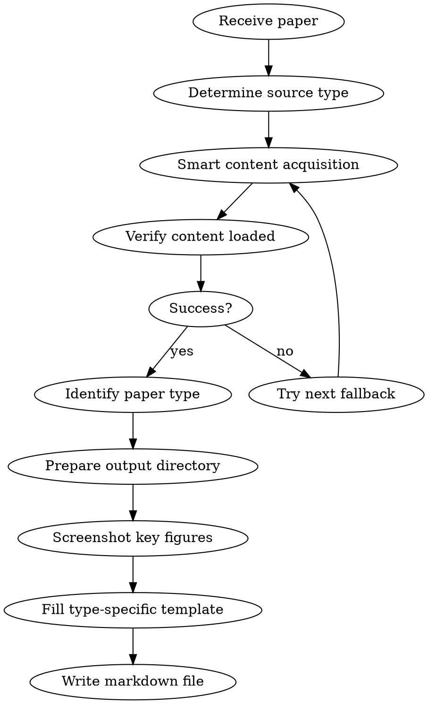

# Paper Reading - Research Paper Summarization

## Overview

A structured approach to reading and summarizing scientific research papers. **Automatically identifies paper type** (empirical/theoretical/survey/systems), selects the appropriate template, screenshots important figures, and embeds them in the summary document.

## When to Use

- User provides a paper (PDF path, URL, or pasted content) and asks for summary
- User asks to "read", "summarize", or "analyze" a research paper
- User wants to understand a paper's contribution quickly
- Literature review tasks

**Not for:** Tutorial papers, textbooks, or non-research documents

## Workflow



## Step 1: Smart Content Acquisition

### Source Identification and Acquisition Strategy

Automatically select the best acquisition path based on paper source:

| Source | Detection | Primary | Fallback 1 | Fallback 2 |
|--------|-----------|---------|------------|------------|
| arXiv | URL contains `arxiv.org` | ar5iv HTML (Playwright) | WebFetch ar5iv | Read PDF |
| ACL Anthology | URL contains `aclanthology.org` | Direct HTML (Playwright) | WebFetch | Read PDF |
| OpenReview | URL contains `openreview.net` | Playwright open | WebFetch | Read PDF |
| Local PDF | File path `.pdf` | Read PDF | — | — |
| Other URL | Default | Playwright open | WebFetch | Prompt user |

### arXiv Paper Acquisition Flow

```
1. Extract paper ID from URL (e.g., 2505.10911)
2. Construct ar5iv URL: https://ar5iv.labs.arxiv.org/html/XXXX.XXXXX
3. browser_navigate to open the page
4. Load verification: browser_run_code to check page contains paper content
   - Check document.querySelector('article, .ltx_document, .ltx_page')
   - If returns null or page title contains "error"/"not found" → mark as failed
5. On failure:
   a. WebFetch the ar5iv URL for plain text
   b. Still failing: Read PDF (arxiv.org/pdf/XXXX.XXXXX)
   c. In PDF mode, inform user "Cannot screenshot figures, text content only"
```

### Non-arXiv Paper Acquisition Flow

```
1. Try Playwright browser_navigate to open URL directly
2. browser_run_code to check page has substantial text content
   - document.body.innerText.length > 500 → success
3. On failure: WebFetch URL
4. Still failing: prompt user to provide PDF file
```

## Step 2: Paper Type Identification

After reading the title, abstract, and introduction, determine paper type:

| Type | Identification Signals |
|------|----------------------|
| **Empirical** | Proposes new method/model, has experimental comparisons, includes baselines |
| **Theoretical** | Theorem/proof-driven, math-heavy derivations, few or no experiments |
| **Survey** | Many citations (>100), taxonomy/classification, "survey"/"review" keywords |
| **Systems** | System design, engineering implementation, benchmarks, deployment experience |

**When uncertain, default to the Empirical template.**

## Step 3: Figure Screenshot Workflow

### 1. Prepare Output Directory

```bash
mkdir -p <output_dir>/images
```

### 2. Discover All Figure Elements

Use `browser_run_code` to list all figures at once:

```javascript
// browser_run_code example
async (page) => {
  const figures = await page.locator('figure, .ltx_figure, .ltx_table').all();
  const results = [];
  for (let i = 0; i < figures.length; i++) {
    const fig = figures[i];
    const caption = await fig.locator('figcaption, .ltx_caption').first().textContent().catch(() => '');
    const id = await fig.getAttribute('id').catch(() => '');
    const box = await fig.boundingBox().catch(() => null);
    results.push({ index: i, id, caption: caption?.slice(0, 200), hasBox: !!box });
  }
  return JSON.stringify(results, null, 2);
}
```

### 3. Screenshot Important Figures

**Priority guide:**

| Priority | Figure Type | When to Capture |
|----------|-------------|-----------------|
| Must | System architecture / overall framework | Always |
| Must | Main experiment results table/chart | Always |
| Recommended | Core algorithm flowchart | If available |
| Recommended | Ablation study charts | If available |
| Optional | Visualization / qualitative results | If space allows |
| Optional | Auxiliary illustrations | As needed |

**Screenshot operation — use `browser_run_code` for precise capture:**

```javascript
// For each important figure
async (page) => {
  // Method 1: element screenshot (preferred)
  const fig = page.locator('figure, .ltx_figure').nth(INDEX);
  await fig.scrollIntoViewIfNeeded();
  await fig.screenshot({ path: '<output_dir>/images/figure_N_desc.png' });
  return 'success';
}
```

**If element screenshot fails, use fallback:**

```javascript
// Fallback: clip-based screenshot
async (page) => {
  const fig = page.locator('figure, .ltx_figure').nth(INDEX);
  await fig.scrollIntoViewIfNeeded();
  const box = await fig.boundingBox();
  if (box) {
    // Slightly expand capture area to ensure completeness
    await page.screenshot({
      path: '<output_dir>/images/figure_N_desc.png',
      clip: {
        x: Math.max(0, box.x - 10),
        y: Math.max(0, box.y - 10),
        width: box.width + 20,
        height: box.height + 20
      }
    });
    return 'fallback success';
  }
  return 'failed';
}
```

### 4. Screenshot Verification

After each screenshot, use Read tool to verify the image file:
- File exists
- File size > 1KB (rules out blank screenshots)

### 5. File Naming

Format: `figure_N_<brief_desc>.png`

Examples:
- `figure_1_overview.png` — system overview
- `figure_2_architecture.png` — model architecture
- `figure_3_results.png` — main experimental results
- `figure_4_ablation.png` — ablation study

Capture **3-8** key figures per paper.

## Step 4: Fill Template

### After identifying paper type, select the corresponding template

All types share these sections:

```markdown
## Basic Information
- **Title:**
- **Authors:**
- **Affiliation:** (optional)
- **Published:**
- **Link:**
- **Paper Type:** [Empirical / Theoretical / Survey / Systems]

## Research Problem
- **What problem does it solve?**
- **Key assumptions:** What constraints/limitations frame the research
- **Why is it important?** (optional)
```

---

### Template A: Empirical Paper

```markdown
## Basic Information
[shared section]

## Research Problem
[shared section]
- **Mathematical formulation:** (optional)

<!-- Insert problem definition/motivation figure here if available -->

## Technical Method
### Overall Framework and Principles
<!-- Insert architecture diagram -->


- Overall system architecture description
- Modules/components and their responsibilities
- Signal/data flow direction

### Core Component Details
<!-- Insert algorithm flowchart here if available -->

- Model/algorithm architecture details (layers, dimensions, input/output)
- Training objective and loss function (write key equations)
- Training data source (synthetic/real/mixed, dataset names)
- Key tricks and design decisions

## Experimental Results
<!-- Insert experiment result figures/tables -->


- **Experimental setup:** Environment, hardware, hyperparameters
- **Baselines compared:**
- **Key results summary:** Quantitative improvement margins
- **Ablation study:** Component contributions

<!-- Insert ablation or visualization result figures here if available -->

## Summary
[shared section]
```

---

### Template B: Theoretical Paper

```markdown
## Basic Information
[shared section]

## Research Problem
[shared section]
- **Mathematical formulation:** Formal problem definition

## Theoretical Framework
### Problem Formalization
- Symbol definitions and notation conventions
- Core mathematical definitions

### Main Theorems and Proof Sketches
- **Theorem 1:** Statement + key proof idea (not full proof, but key steps)
- **Theorem 2:** ...
- Key techniques/lemmas used in proofs

### Theoretical Analysis
- Implications and intuitive interpretation of results
- Tightness of upper/lower bounds
- Relationship to and comparison with known results

## Validation (if experiments exist)
- Experimental setup
- Comparison of theoretical predictions vs actual results

## Summary
[shared section]
```

---

### Template C: Survey Paper

```markdown
## Basic Information
[shared section]
- **Coverage:** Number of papers surveyed, time span

## Research Problem
[shared section]

## Taxonomy
<!-- Insert taxonomy/classification figure -->


- Main classification dimensions
- Category definitions and representative works

### Direction 1: [Name]
- Key methods and advances
- Representative works (author, year)
- Pros and cons

### Direction 2: [Name]
- ...

### Method Comparison
| Method Type | Strengths | Weaknesses | Representative Works |
|-------------|-----------|------------|---------------------|
| ... | ... | ... | ... |

## Open Problems and Trends
- Current major challenges in the field
- Emerging trends and directions
- Authors' predictions and recommendations

## Summary
[shared section]
```

---

### Template D: Systems Paper

```markdown
## Basic Information
[shared section]

## Research Problem
[shared section]
- **Design goals:** Key requirements the system must meet

## System Design
### Architecture Overview
<!-- Insert system architecture diagram -->


- Overall architecture and component breakdown
- Component responsibilities and interfaces

### Key Design Decisions
- Decision 1: What choice was made, why
- Decision 2: Trade-offs considered
- Key differences from existing systems

### Implementation Details
- Key tech stack/dependencies
- Optimization techniques
- Fault tolerance / scalability design

## Performance Evaluation
<!-- Insert performance comparison figures/tables -->


- **Benchmark setup:** Environment, hardware, workloads
- **Compared systems:**
- **Key metrics:** Throughput, latency, resource usage
- **Scalability:** Performance as scale increases

## Deployment Experience (if available)
- Real-world production performance
- Problems encountered and solutions

## Summary
[shared section]
```

---

### Shared Summary Section

```markdown
## Summary
- **Core idea:** One sentence summarizing the core contribution
- **Main highlight:** What makes this stand out from prior work
- **Future directions:** Natural next steps
- **Critiques:** Specific limitations (must name concrete issues, not vague statements)
```

## Section Writing Guidelines

### Basic Information
- Extract from paper header, abstract, or metadata
- For links: use DOI if available, otherwise arXiv or publisher URL

### Research Problem
- Focus on the GAP the paper addresses
- Mathematical description: include key equations if present
- Assumptions: what constraints or simplifications does the approach make?

### Technical Method (Empirical)
- **Architecture first:** Draw the big picture before diving into components
- **Be specific:** Dimensions, layer counts, parameter counts — not just "a network"
- **Loss functions:** Write the actual LaTeX equation if provided
- **Training data:** Note if synthetic, real-world, or mixed; mention dataset names and scale
- **Must insert architecture diagram screenshot**

### Experimental Results
- Focus on **quantitative improvements** over baselines (specific numbers and percentages)
- Note which metrics matter most for this problem domain
- Mention any surprising or counterintuitive results
- **Must insert main result figure/table screenshot**

### Summary
- **Core idea:** One sentence
- **Highlight:** What is this paper's unique contribution
- **Extensions:** Natural next steps
- **Critiques:** Must be specific ("only validated in X scenario" not "has limitations")

## Common Mistakes

| Mistake | Correction |
|---------|------------|
| Copying abstract verbatim | Synthesize in your own words |
| Missing key assumptions | Explicitly state what the method assumes |
| Vague architecture description | Include specific dimensions and layer types |
| Ignoring failure cases | Note where method underperforms |
| Skipping mathematical notation | Include key LaTeX equations when available |
| Not screenshotting paper figures | Must capture architecture and main result figures |
| Misplaced image insertion | Images should be adjacent to corresponding text |
| Vague critiques | Must name specific limitations (scenario, data, assumptions) |
| Wrong paper type classification | Read abstract and intro fully before classifying; default to Empirical |
| Giving up after screenshot failure | Try element screenshot first, fall back to clip-based screenshot |

## Language

- Output summary in the user's preferred language
- Technical terms can remain in English (API, Loss, Baseline, etc.)
- Code and equations in original form
- Translate figure captions to user's preferred language
