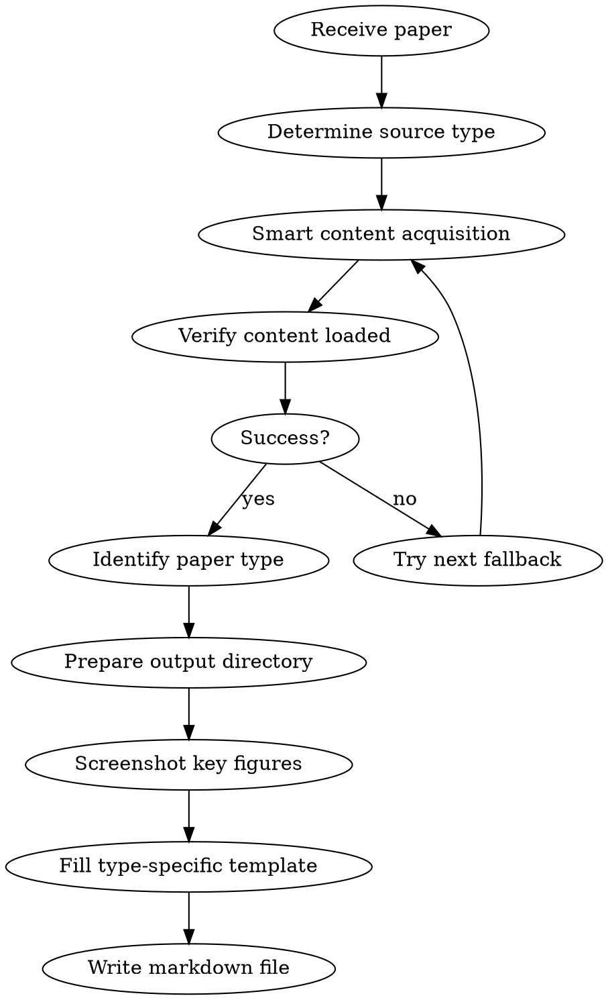

# Paper Reading - Research Paper Summarization

## Overview

A structured approach to reading and summarizing scientific research papers. **Automatically identifies paper type** (empirical/theoretical/survey/systems), selects the appropriate template, screenshots important figures, and embeds them in the summary document.

## When to Use

- User provides a paper (PDF path, URL, or pasted content) and asks for summary
- User asks to "read", "summarize", or "analyze" a research paper
- User wants to understand a paper's contribution quickly
- Literature review tasks

**Not for:** Tutorial papers, textbooks, or non-research documents

## Workflow



## Step 1: Smart Content Acquisition

### Source Identification and Acquisition Strategy

Automatically select the best acquisition path based on paper source:

| Source | Detection | Primary | Fallback 1 | Fallback 2 |
|--------|-----------|---------|------------|------------|
| arXiv | URL contains `arxiv.org` | ar5iv HTML (Playwright) | WebFetch ar5iv | Read PDF |
| ACL Anthology | URL contains `aclanthology.org` | Direct HTML (Playwright) | WebFetch | Read PDF |
| OpenReview | URL contains `openreview.net` | Playwright open | WebFetch | Read PDF |
| Local PDF | File path `.pdf` | Read PDF | — | — |
| Other URL | Default | Playwright open | WebFetch | Prompt user |

### arXiv Paper Acquisition Flow

```
1. Extract paper ID from URL (e.g., 2505.10911)
2. Construct ar5iv URL: https://ar5iv.labs.arxiv.org/html/XXXX.XXXXX
3. browser_navigate to open the page
4. Load verification: browser_run_code to check page contains paper content
   - Check document.querySelector('article, .ltx_document, .ltx_page')
   - If returns null or page title contains "error"/"not found" → mark as failed
5. On failure:
   a. WebFetch the ar5iv URL for plain text
   b. Still failing: Read PDF (arxiv.org/pdf/XXXX.XXXXX)
   c. In PDF mode, inform user "Cannot screenshot figures, text content only"
```

### Non-arXiv Paper Acquisition Flow

```
1. Try Playwright browser_navigate to open URL directly
2. browser_run_code to check page has substantial text content
   - document.body.innerText.length > 500 → success
3. On failure: WebFetch URL
4. Still failing: prompt user to provide PDF file
```

## Step 2: Paper Type Identification

After reading the title, abstract, and introduction, determine paper type:

| Type | Identification Signals |
|------|----------------------|
| **Empirical** | Proposes new method/model, has experimental comparisons, includes baselines |
| **Theoretical** | Theorem/proof-driven, math-heavy derivations, few or no experiments |
| **Survey** | Many citations (>100), taxonomy/classification, "survey"/"review" keywords |
| **Systems** | System design, engineering implementation, benchmarks, deployment experience |

**When uncertain, default to the Empirical template.**

## Step 3: Figure Screenshot Workflow

### 1. Prepare Output Directory

```bash
mkdir -p <output_dir>/images
```

### 2. Discover All Figure Elements

Use `browser_run_code` to list all figures at once:

```javascript
// browser_run_code example
async (page) => {
  const figures = await page.locator('figure, .ltx_figure, .ltx_table').all();
  const results = [];
  for (let i = 0; i < figures.length; i++) {
    const fig = figures[i];
    const caption = await fig.locator('figcaption, .ltx_caption').first().textContent().catch(() => '');
    const id = await fig.getAttribute('id').catch(() => '');
    const box = await fig.boundingBox().catch(() => null);
    results.push({ index: i, id, caption: caption?.slice(0, 200), hasBox: !!box });
  }
  return JSON.stringify(results, null, 2);
}
```

### 3. Screenshot Important Figures

**Priority guide:**

| Priority | Figure Type | When to Capture |
|----------|-------------|-----------------|
| Must | System architecture / overall framework | Always |
| Must | Main experiment results table/chart | Always |
| Recommended | Core algorithm flowchart | If available |
| Recommended | Ablation study charts | If available |
| Optional | Visualization / qualitative results | If space allows |
| Optional | Auxiliary illustrations | As needed |

**Screenshot operation — use `browser_run_code` for precise capture:**

```javascript
// For each important figure
async (page) => {
  // Method 1: element screenshot (preferred)
  const fig = page.locator('figure, .ltx_figure').nth(INDEX);
  await fig.scrollIntoViewIfNeeded();
  await fig.screenshot({ path: '<output_dir>/images/figure_N_desc.png' });
  return 'success';
}
```

**If element screenshot fails, use fallback:**

```javascript
// Fallback: clip-based screenshot
async (page) => {
  const fig = page.locator('figure, .ltx_figure').nth(INDEX);
  await fig.scrollIntoViewIfNeeded();
  const box = await fig.boundingBox();
  if (box) {
    // Slightly expand capture area to ensure completeness
    await page.screenshot({
      path: '<output_dir>/images/figure_N_desc.png',
      clip: {
        x: Math.max(0, box.x - 10),
        y: Math.max(0, box.y - 10),
        width: box.width + 20,
        height: box.height + 20
      }
    });
    return 'fallback success';
  }
  return 'failed';
}
```

### 4. Screenshot Verification

After each screenshot, use Read tool to verify the image file:
- File exists
- File size > 1KB (rules out blank screenshots)

### 5. File Naming

Format: `figure_N_<brief_desc>.png`

Examples:
- `figure_1_overview.png` — system overview
- `figure_2_architecture.png` — model architecture
- `figure_3_results.png` — main experimental results
- `figure_4_ablation.png` — ablation study

Capture **3-8** key figures per paper.

## Step 4: Fill Template

### After identifying paper type, select the corresponding template

### Writing Principles (Critical)

**Depth-first**: For every section, ask "why" and "how", not just "what".

| Shallow writing (prohibited) | Deep writing (required) |
|------------------------------|------------------------|
| "Proposes a new method" | "Addresses bottleneck Y in problem X via mechanism Z" |
| "Achieves SOTA results" | "Improves X% over method B on dataset A, primarily because of Y" |
| "Uses a Transformer" | "Uses L-layer Transformer with input dim D, H attention heads, key modification is Z" |
| "Has some limitations" | "Only validated in scenario X, does not account for distribution shift Y, assumption Z may not hold in practice" |

### Mathematical Content Requirements (Critical)

When the paper contains meaningful mathematical content, the summary must preserve it instead of flattening it into prose.

Required standard:

1. **Keep key equations** for the method, objective, loss, theorem statement, update rule, or scoring function.
2. **Render equations in Typora-friendly LaTeX**:
   - Use block math with `$$ ... $$`
   - Use inline math with `$...$`
   - Do **not** leave mathematical expressions in plain code blocks like ```text``` if they are intended to be read as formulas
3. **Explain symbols immediately after formulas**
   - Define the main variables, indices, and operators
   - Prefer concise bullet definitions
4. **Add a short “plain-language explanation” after each important formula**
   - Explain what the formula is doing in the system
   - Explain why it matters for training / inference / analysis
5. **Translate metric names when useful**
   - If the paper uses dense metric abbreviations, keep the original symbol and add a short Chinese explanation
   - Example: `$E_{mpjpe}$`: average joint position error

Minimum bar for empirical papers:

- Problem formulation or training objective if provided
- Core method equation(s)
- Loss / reward / scoring equation(s)
- Key update rule if central to the contribution

Minimum bar for theoretical papers:

- Formal problem statement
- Main theorem statements or core bounds
- Essential symbol definitions
- Intuitive interpretation after each major result

If the paper is light on math, do not invent formulas; only preserve what is actually central.

### Related Work Formatting Requirements (Critical)

When the paper explicitly organizes related work into named categories, the summary must preserve that structure.

Required standard:

1. **Preserve the paper's original related-work categories**
   - Example: if the paper splits related work into `Physics-based Humanoid Locomotion` and `Human-Object Interaction`, keep those categories in the summary
   - Do not flatten all baselines into one generic comparison if category structure matters
2. **Prefer tables over long prose for related work**
   - Use separate tables per category when helpful
   - Recommended columns: method/direction, core goal, strengths, limitations, relation to this paper
3. **Keep related-work tables visually subordinate to the main section**
   - They should remain inside the broader related-work positioning discussion
   - Do not promote each category to the same visual weight as major summary sections unless the user explicitly wants that
   - When Markdown/Typora rendering allows, it is acceptable to wrap the grouped related-work tables in a small-font block such as `<div style="font-size: 0.92em;"> ... </div>`
4. **Place baselines in the correct category before comparing them**
   - Example: ASAP may belong under motion tracking / locomotion-style methods, while InterMimic belongs under HOI methods
5. **After the category tables, optionally include one short synthesis table**
   - Example: “This paper’s position” with 3-5 rows summarizing what it inherits and what it adds

If the user explicitly asks for tables, do not rewrite the related-work section as long prose paragraphs.

### After identifying paper type, select the corresponding template

All types share these sections:

```markdown
## Basic Information
- **Title:**
- **Authors:**
- **Affiliation:** (optional)
- **Published:**
- **Link:**
- **Paper Type:** [Empirical / Theoretical / Survey / Systems]
- **One-line summary:** What was done + how + what was the result

## Research Problem
- **What problem does it solve?** Identify the specific gap in existing methods
- **Key assumptions:** What constraints/limitations frame the research
- **Why is it important?** The practical impact on the field
- **Positioning among related work:** What are the 2-3 closest prior works? What is the key difference? Preserve any original related-work categories; prefer compact tables when comparing methods.
```

---

### Template A: Empirical Paper

```markdown
## Basic Information
[shared section]

## Research Problem
[shared section]
- **Mathematical formulation:** (optional)
- **Related work formatting:** Preserve original categories and summarize baselines with compact tables when appropriate

<!-- Insert problem definition/motivation figure here if available -->

## Key Insight
> Distill the paper's core new idea in 2-3 sentences. Not "what was done", but "what insight makes this method work".
> Example: Rather than predicting frame-by-frame, first establish long-term 3D point tracking, then leverage temporal consistency for joint optimization.

## Technical Method
### Overall Framework and Principles
<!-- Insert architecture diagram -->


- Overall system architecture description
- Modules/components and their responsibilities
- Signal/data flow direction
- **Why this design?** Advantages over the intuitive/naive approach

### Mathematical Formulation and Symbols
- Include the core equations in Typora-friendly LaTeX if the paper provides them
- Define the main symbols right after the equations
- Add 1-3 sentences of plain-language explanation after each key equation
- If the method has multiple stages, separate formulas by stage (e.g. problem setup, model update, reward/loss, meta-objective)

### Core Component Details
<!-- Insert algorithm flowchart here if available -->

- Model/algorithm architecture details (layers, dimensions, input/output)
- Training objective and loss function (write key equations)
- Training data source (synthetic/real/mixed, dataset names and scale)
- Key tricks and design decisions
- **Motivation for each design choice:** Why use A instead of B? Does the paper provide justification?

## Experimental Results
<!-- Insert experiment result figures/tables -->


### Results (Facts)
- **Experimental setup:** Environment, hardware, hyperparameters
- **Baselines compared:** List specific method names and sources
- **Key results:** Quantitative improvement margins (specific numbers + percentages)
- **Ablation study:** Component contributions (removing X decreases performance by Y%)
- **Surprising findings:** Any counterintuitive results
- **Metric glossary:** For symbols like `$E_{xxx}$`, keep the original notation and add a short natural-language explanation

### Analysis (Interpretation)
- Authors' explanation and attribution of results
- Which scenarios/datasets show best performance? Worst?
- Root cause of performance gains (authors' claims vs actual evidence)

<!-- Insert ablation or visualization result figures here if available -->

## Critical Analysis
### Strengths
- Specific improvements over prior work (not just "good results")

### Limitations
- **Acknowledged by authors:**
- **My observations:** Issues not mentioned in the paper
  - Do assumptions hold in practice?
  - Are compute/data requirements reasonable?
  - Are evaluation metrics comprehensive?

### Reproducibility Assessment
- Is code open-sourced? Is data available?
- Are key implementation details sufficiently described?

## Summary
[shared section]
```

---

### Template B: Theoretical Paper

```markdown
## Basic Information
[shared section]

## Research Problem
[shared section]
- **Mathematical formulation:** Formal problem definition

## Key Insight
> Distill the paper's core theoretical contribution in 2-3 sentences. What new mathematical tool/perspective makes this result possible?

## Theoretical Framework
### Problem Formalization
- Symbol definitions and notation conventions
- Core mathematical definitions

### Main Theorems and Proof Sketches
- **Theorem 1:** Statement + key proof idea (not full proof, but key steps and key lemmas)
- **Theorem 2:** ...
- Key techniques used in proofs: Why does this technique work? Is there a more intuitive explanation?

### Theoretical Analysis
- Implications and intuitive interpretation of results (restate in non-mathematical language)
- Tightness of upper/lower bounds
- Relationship to and comparison with known results: Which bound was improved? Which assumption was relaxed?

## Validation (if experiments exist)
- Experimental setup
- Comparison of theoretical predictions vs actual results
- How is the gap between theory and experiments explained?

## Critical Analysis
### Strengths
- Importance and novelty of the theoretical contribution

### Limitations
- **Acknowledged by authors:**
- **My observations:** Reasonableness of assumptions, practical utility, difficulty of generalization

## Summary
[shared section]
```

---

### Template C: Survey Paper

```markdown
## Basic Information
[shared section]
- **Coverage:** Number of papers surveyed, time span

## Research Problem
[shared section]

## Key Insight
> What is the core contribution of this survey? What classification perspective was proposed, or what important trends were identified?

## Taxonomy
<!-- Insert taxonomy/classification figure -->


- Main classification dimensions and rationale for their selection
- Category definitions and representative works

### Direction 1: [Name]
- Key methods and advances
- Representative works (author, year)
- Pros and cons
- **Current bottleneck:** The core challenge facing this direction

### Direction 2: [Name]
- ...

### Method Comparison
| Method Type | Strengths | Weaknesses | Representative Works | Best Use Case |
|-------------|-----------|------------|---------------------|---------------|
| ... | ... | ... | ... | ... |

## Open Problems and Trends
- Current major challenges in the field
- Emerging trends and directions
- Authors' predictions and recommendations
- **Most promising direction:** Based on the survey analysis, which direction deserves most attention? Why?

## Critical Analysis
- Is the survey's coverage comprehensive? Any important directions missed?
- Is the taxonomy reasonable? Could it be organized better?
- Do the authors' opinions/biases affect the survey's objectivity?

## Summary
[shared section]
```

---

### Template D: Systems Paper

```markdown
## Basic Information
[shared section]

## Research Problem
[shared section]
- **Design goals:** Key requirements the system must meet

## Key Insight
> What is the core design insight of this system? What trade-off or observation makes this design superior to existing solutions?

## System Design
### Architecture Overview
<!-- Insert system architecture diagram -->


- Overall architecture and component breakdown
- Component responsibilities and interfaces

### Key Design Decisions
- Decision 1: What choice was made, why (and not the alternative)
- Decision 2: Trade-offs considered (performance vs complexity vs maintainability)
- Key differences from existing systems

### Implementation Details
- Key tech stack/dependencies
- Optimization techniques
- Fault tolerance / scalability design

## Performance Evaluation
<!-- Insert performance comparison figures/tables -->


### Experimental Facts
- **Benchmark setup:** Environment, hardware, workloads
- **Compared systems:**
- **Key metrics:** Throughput, latency, resource usage (specific numbers)
- **Scalability:** Performance as scale increases

### Result Interpretation
- Under what conditions does it perform best? When does it degrade?
- Root cause of performance advantages

## Deployment Experience (if available)
- Real-world production performance
- Problems encountered and solutions

## Critical Analysis
### Strengths
- Design elegance and practicality

### Limitations
- **Acknowledged by authors:**
- **My observations:** Deployment assumptions, hardware dependencies, generalizability

## Summary
[shared section]
```

---

### Shared Summary Section

```markdown
## Summary and Evaluation

### Three-Perspective Conclusion (Andrew Ng Framework)

**Authors' conclusion:** What do the authors claim to have accomplished? What goals were achieved?

**Personal assessment:**
- Did the authors truly achieve their claimed goals? Is the evidence sufficient?
- How much does this work actually advance the field?

**Overall evaluation:**
- **Core idea:** One sentence summarizing the core contribution
- **Main highlight:** What stands out compared to prior work
- **Future directions:** Natural next steps
- **Rating:** [Breakthrough / Important / Valuable / Incremental]

### Comprehension Verification (Self-check after writing)
1. What were the authors trying to accomplish?
2. What are the key elements of the approach?
3. What can I use in my own research?
4. What references are worth reading further?
```

## Section Writing Guidelines

### Basic Information
- Extract from paper header, abstract, or metadata
- For links: use DOI if available, otherwise arXiv or publisher URL
- **One-line summary must include: what was done + how + what was the result**

### Research Problem
- Focus on the **specific gap** the paper addresses, not generic field descriptions
- Mathematical description: include key equations if present
- Assumptions: what constraints or simplifications does the approach make?
- **Related work positioning:** Must mention 2-3 closest prior works and explain what makes this paper unique

### Key Insight
- This is the most important paragraph — distill the **key insight** that makes the method work
- Not a paraphrase of the abstract, but answering "what is this paper's core new idea?"
- Good example: "Observed phenomenon X, thus leveraging Y to achieve Z"
- Bad example: "Proposes a new method to solve problem A" (too vague)

### Technical Method (Empirical)
- **Architecture first:** Draw the big picture before diving into components
- **Be specific:** Dimensions, layer counts, parameter counts — not just "a network"
- **Loss functions:** Write the actual LaTeX equation if provided
- **Training data:** Note if synthetic, real-world, or mixed; mention dataset names and scale
- **Design motivation:** Every key design choice should explain why (paper's justification or inferred reasoning)
- **Must insert architecture diagram screenshot**

### Experimental Results
- **Separate facts from interpretation:** Results section writes experimental data only; Analysis section writes explanations and attribution
- Focus on **quantitative improvements** over baselines (specific numbers and percentages)
- Note which metrics matter most for this problem domain
- Mention any surprising or counterintuitive results
- Note best and worst performing scenarios/datasets
- **Must insert main result figure/table screenshot**

### Critical Analysis
- **Strengths:** Must specify concrete improvements, not just "good results"
- **Limitations:** Separately list author-acknowledged and self-discovered ones
- **Reproducibility:** Is code/data open-sourced? Are implementation details sufficient?

### Summary and Evaluation
- **Three perspectives:** Authors' conclusion → Personal assessment → Overall evaluation
- **Rating:** Choose from [Breakthrough / Important / Valuable / Incremental] with justification
- **Comprehension verification:** Self-check with 4 questions after writing (Andrew Ng framework)

## Common Mistakes

| Mistake | Correction |
|---------|------------|
| Copying abstract verbatim | Synthesize in your own words, distill the key insight |
| Missing key assumptions | Explicitly state what the method assumes |
| Vague architecture description | Include specific dimensions and layer types |
| Ignoring failure cases | Note where method underperforms and on which datasets |
| Skipping mathematical notation | Include key LaTeX equations when available |
| Not screenshotting paper figures | Must capture architecture and main result figures |
| Misplaced image insertion | Images should be adjacent to corresponding text |
| Vague critiques | Must name specific limitations (scenario, data, assumptions) |
| Wrong paper type classification | Read abstract and intro fully before classifying; default to Empirical |
| Giving up after screenshot failure | Try element screenshot first, fall back to clip-based screenshot |
| Writing only "what" without "why" | Every design choice should explain the motivation and justification |
| Mixing results and conclusions | Separate experimental facts (Results) from author interpretation (Analysis) |
| Missing related work positioning | Must compare against 2-3 closest prior works |
| Key Insight too vague or missing | Key Insight must be a specific, actionable new idea |
| Evaluation missing three perspectives | Separately write authors' conclusion, personal assessment, overall evaluation |
| Not distinguishing author-acknowledged vs self-discovered limitations | Critical Analysis must separate the two types of limitations |

## Language

- Output summary in the user's preferred language
- Technical terms can remain in English (API, Loss, Baseline, etc.)
- Code and equations in original form
- Translate figure captions to user's preferred language
