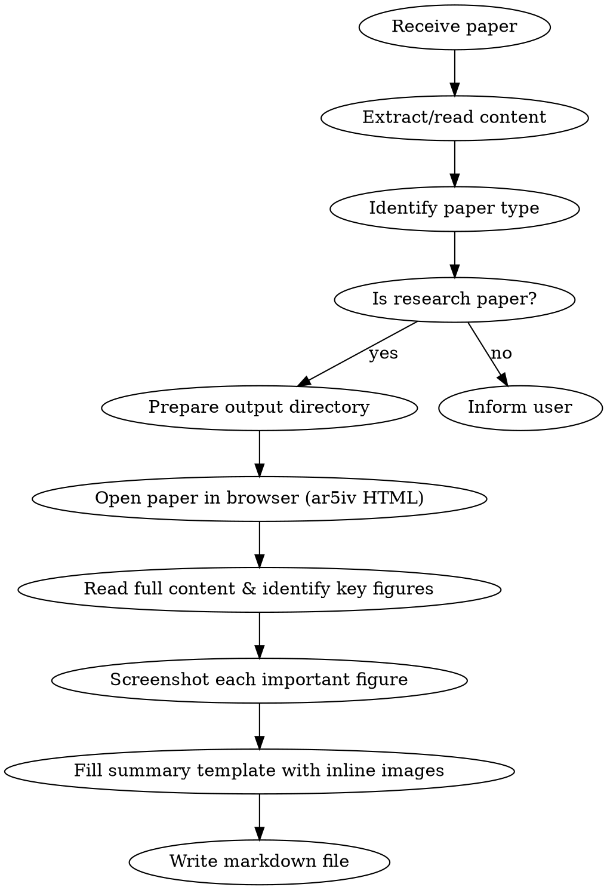

# Paper Reading - Research Paper Summarization

## Overview

A structured approach to reading and summarizing scientific research papers. Outputs a comprehensive summary in a standardized format covering research questions, methods, experiments, and key insights. **Automatically screenshots important figures (architecture diagrams, experiment results, key illustrations, etc.) and embeds them in the summary document.**

## When to Use

- User provides a paper (PDF path, URL, or pasted content) and asks for summary
- User asks to "read", "summarize", or "analyze" a research paper
- User wants to understand a paper's contribution quickly
- Literature review tasks

**Not for:** Tutorial papers, textbooks, or non-research documents

## Workflow



## Figure Screenshot Workflow (Key Steps)

### 1. Prepare Output Directory

```bash
# Create under user-specified directory (or current directory):
mkdir -p <output_dir>/images
```

### 2. Get Paper HTML Version

- For arXiv papers: replace `arxiv.org/abs/XXXX.XXXXX` with `ar5iv.labs.arxiv.org/html/XXXX.XXXXX`
- Use Playwright **browser_navigate** to open the ar5iv HTML page
- If ar5iv is unavailable, use original PDF as fallback (via Read tool)

### 3. Identify and Screenshot Important Figures

Use Playwright tools for screenshots. **Must capture these figure types:**

| Priority | Figure Type | Description |
|----------|-------------|-------------|
| High | System architecture | Overall method framework, model structure |
| High | Core algorithm flowchart | Training/inference pipeline |
| High | Main experiment results | Comparison tables/charts vs baselines |
| Medium | Visualization results | Qualitative comparisons, generated samples |
| Medium | Ablation study charts | Component contribution analysis |
| Low | Auxiliary illustrations | Problem definition, motivation examples |

**Screenshot procedure:**

```
1. Use browser_run_code to locate all figure elements and their IDs/captions
2. For each important figure:
   a. Use browser_run_code with Playwright locator to scroll to and screenshot the figure element
      - Use attribute selector [id="FIGURE_ID"] to handle dots in IDs
      - Save to "<output_dir>/images/figure_N_<desc>.png"
      - Use type: "png" for high quality
   b. Record figure caption and number
3. If page is long, scroll to target figure position before screenshotting
```

**Important:**
- Screenshot using element locator for precise figure region capture, not the entire page
- Filename format: `figure_1_overview.png`, `figure_2_framework.png`, ...
- Capture **3-8** key figures per paper; never skip architecture diagrams and main result figures

### 4. Embed Images in Summary

Insert image references in corresponding sections of the markdown summary:

```markdown
### Overall Framework and Principles

*Figure 1: Overall system architecture...*

### Experimental Results

*Figure 4: Performance comparison with baseline methods...*
```

## Output Template

Use this exact format for all research paper summaries, **with screenshots inserted at corresponding positions:**

```markdown
## Basic Information
- **Title:**
- **Authors:**
- **Affiliation:** (optional)
- **Published:**
- **Link:**

## Research Problem
- **What problem does it solve?**
- **Mathematical formulation:** (optional)
- **Key assumptions:** What constraints/limitations frame the research
- **Why is it important?** (optional)

<!-- Insert problem definition/motivation figure here if available -->

## Technical Method
### Overall Framework and Principles (if applicable)
<!-- Insert architecture diagram -->


- System architecture diagram
- How many neural networks, each one's input/output, purpose
- Signal update frequency

### Specific Algorithms (for each neural network)
<!-- Insert algorithm flowchart here if available -->

- Network architecture (layers, construction), input/output
- Training objective and loss function
- How is training data obtained?
- Training algorithm insights and tricks

## Experimental Results
<!-- Insert experiment result figures/tables -->


- **Experimental setup:** How was it constructed?
- **Baselines compared:**
- **Key results summary:** Where does it show clear advantages?

<!-- Insert ablation study or visualization results here if available -->

## Summary
- **Core idea:**
- **Main highlight:**
- **Future directions:**
- **Critiques:**
```

## Section Guidelines

### Basic Information
- Extract from paper header, abstract, or metadata
- For links: use DOI if available, otherwise arXiv or publisher URL

### Research Problem
- Focus on the GAP the paper addresses
- Mathematical description: include key equations if present
- Assumptions: what constraints or simplifications does the approach make?

### Technical Method
- **Architecture first:** Draw the big picture before diving into components
- **For each neural network:** Be specific about input dimensions, output dimensions, layer counts
- **Loss functions:** Write the actual equation if provided
- **Training data:** Note if synthetic, real-world, or mixed; mention dataset names
- **Must insert architecture diagram screenshot**

### Experimental Results
- Focus on quantitative improvements over baselines
- Note which metrics matter most for this problem domain
- Mention any surprising or counterintuitive results
- **Must insert main result figure/table screenshot**

### Summary
- **Core idea:** One sentence capturing the core contribution
- **Highlight:** What makes this paper stand out from prior work?
- **Extensions:** What would be natural next steps?
- **Critiques:** Limitations, missing comparisons, questionable assumptions

## Common Mistakes

| Mistake | Correction |
|---------|------------|
| Copying abstract verbatim | Synthesize in your own words |
| Missing key assumptions | Explicitly state what the method assumes |
| Vague architecture description | Include specific dimensions and layer types |
| Ignoring failure cases | Note where method underperforms |
| Skipping mathematical notation | Include key equations when available |
| Not screenshotting paper figures | Must capture architecture and main result figures |
| Misplaced image insertion | Images should be adjacent to corresponding text |
| Screenshotting entire page instead of individual figure | Use element locator for precise capture |

## Language

- Output summary in the user's preferred language
- Technical terms can remain in English (API, Loss, Baseline, etc.)
- Code and equations in original form
- Translate figure captions to user's preferred language
